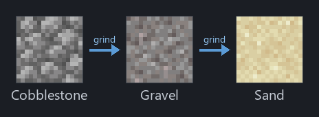
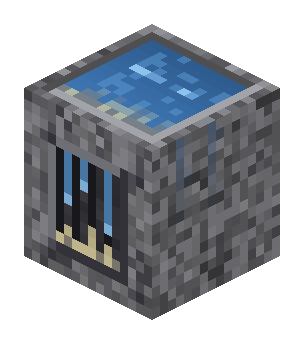
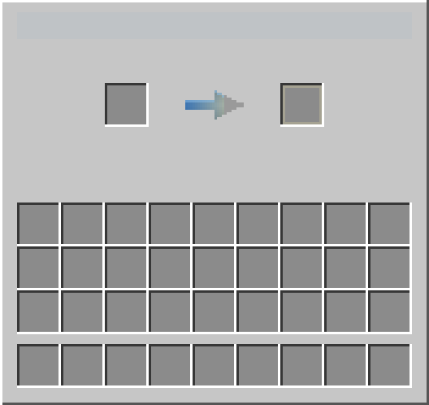
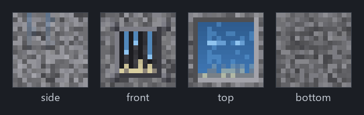

<p align="center">
  
</p>

# Weathering Chamber

A Fabric mod that makes **sand a renewable resource**, built as a **single Mojmap
codebase** that compiles for **both Minecraft 1.21.1 and 26.2** via
[Stonecutter](https://stonecutter.kikugie.dev).

Sand can't normally be crafted, so this mod adds a furnace-like machine — the
**Weathering Chamber** — that mimics real-world *erosion*: it grinds rock down
into sand, one step at a time.

<p align="center">
  
</p>

Cobblestone is infinitely renewable (a lava + water generator), so everything
downstream of it — gravel and sand — becomes renewable too.

## Preview

<table>
  <tr>
    <td align="center"><br><sub>The block — water basin on top, grinding aperture on the front</sub></td>
    <td align="center"><br><sub>The interface — input, a water→sand progress arrow, and output</sub></td>
  </tr>
</table>

<p align="center">
  
</p>

## How it works

- Place the Weathering Chamber and **put water next to it** (any of the 6 sides;
  a source, flowing water, or a waterlogged block all count). Water is the "fuel."
- Drop **cobblestone** (or **gravel**) into the input slot.
- Each grind takes ~10 seconds. Cobblestone → gravel; gravel → sand.
- Hoppers automate it: they insert into the input and pull from the output.
- Break the machine and it drops its contents (the input/output stacks aren't lost).

**Craft it** around a furnace core, with cobblestone corners, **copper** sides
(the game's *weathering* metal) and **pointed dripstone** top/bottom (formed by
water eroding stone — literally erosion):

```
C D C     C = cobblestone      D = pointed dripstone
K F K     K = copper ingot     F = furnace
C D C
```

## Multi-version layout (Stonecutter)

One source tree builds two jars. Version differences are handled two ways:

**Token replacements** (`stonecutter.gradle.kts`) — uniform renames applied to the
26.x source so the code is written once:

- `ResourceLocation` → `Identifier` (26.x class rename).
- `isClientSide` → `isClientSide()` (26.x made `Level.isClientSide` a private field
  with a public accessor).

**`//?` conditional comments** at the spots where the APIs genuinely diverge —
search the source for `//?` to find them:

| File | 1.21.1 | 26.2 |
|------|--------|------|
| `ModBlocks.java` (registration) | register by `ResourceLocation` | `ResourceKey` + `Properties.setId(...)` |
| `ModBlocks.java` (creative tab) | `ItemGroupEvents.modifyEntriesEvent` | `CreativeModeTabEvents.modifyOutputEvent` |
| `WeatheringChamberBlockEntity.java` (NBT) | `CompoundTag` + `HolderLookup.Provider` | `ValueOutput` / `ValueInput` |
| `WeatheringChamberMenu.java` (inv slots) | manual slot loops | `addStandardInventorySlots(...)` |
| `WeatheringChamberBlock.java` (drop on break) | `onRemove(...)` | `affectNeighborsAfterRemoval(...)` |
| `WeatheringChamberScreen.java` (GUI) | `GuiGraphics.renderBg` + `blit(…)` | `GuiGraphicsExtractor.extractBackground` + `blit(RenderPipelines.GUI_TEXTURED, …)` |

Key files:

| Path | Purpose |
|------|---------|
| `settings.gradle.kts` | Declares versions `1.21.1` + `26.2`, applies Stonecutter + loom-back-compat |
| `stonecutter.gradle.kts` | Active version + the two token-replacement rules |
| `build.gradle.kts` | Mojmap mappings, per-version Java (21 / 25) |
| `stonecutter.properties.toml` | Per-version deps (Fabric API, loader) |
| `src/main/java/com/example/weathering/…` | The mod (Mojmap) |
| `src/main/resources/…` | Blockstate, models, textures, `items/` def, lang, recipe, loot table, tags |
| `tools/generate_assets.py` | Regenerates all textures + the preview art (see below) |

## Building / running

Requires **JDK 21 and JDK 25** available to Gradle (the toolchain block picks the
right one per version; the foojay resolver can auto-provision them).

```bash
./gradlew build          # builds BOTH versions -> versions/<v>/build/libs/
./gradlew chiseledBuild   # same fan-out; the canonical "build every version" task
```

This produces the two distributable jars:

```
versions/1.21.1/build/libs/weathering-1.0.0+1.21.1.jar
versions/26.2/build/libs/weathering-1.0.0+26.2.jar
```

Or open the folder in **IntelliJ IDEA** (with the *Minecraft Development* plugin).
Switch which version your IDE compiles against with the generated Stonecutter task
**`Set active project to 1.21.1`** / **`… 26.2`**; per-version `runClient` /
`runServer` tasks launch a dev game for the active version.

> Both versions **compile and build**. In-game runtime (world load, GUI render,
> datapack load) hasn't been smoke-tested yet — that's the natural next step.
> 26.2 postdates the tooling's training data, but every 26.2 signature here was
> verified against the actual downloaded 26.2 jars.

## Art & assets

Textures are **generated**, not hand-drawn — [`tools/generate_assets.py`](tools/generate_assets.py)
(Pillow + numpy) produces them deterministically from fixed RNG seeds:

- **In-game:** the four 16×16 block faces + the 256×256 GUI sheet, written into
  `src/main/resources/assets/weathering/textures/`.
- **Repo previews:** the banner, isometric render, face card, GUI preview, and
  erosion-chain diagram in `docs/img/` (everything shown in this README).

Regenerate everything with:

```bash
python tools/generate_assets.py
```

## Extending it

- **More recipes:** add entries to the `EROSION` map in `WeatheringChamberBlockEntity`.
- **Retexture:** edit the palette/shapes in `tools/generate_assets.py` and rerun it.
- **Grind speed:** change `maxProgress` (ticks; 20 = 1 second).

## Publishing to both versions

Upload **both** jars above to a single Modrinth / CurseForge project, each tagged
with its Minecraft version.

## Versions

Stonecutter `0.9.7` · Loom `1.17` · Gradle `9.6.1` · loader `0.19.3` ·
Fabric API `0.116.15+1.21.1` / `0.156.0+26.2` · Java `21` (1.21.1) / `25` (26.2).
